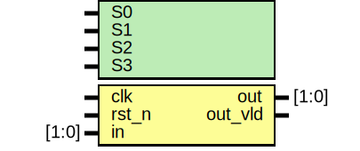
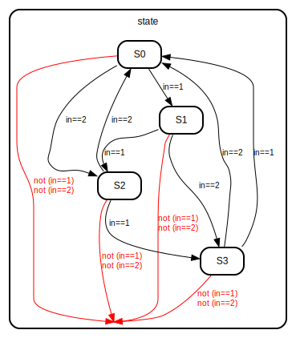

# Entity: fsm_sale 

- **File**: fsm_sale.v
## Diagram

## Generics

| Generic name | Type | Value   | Description |
| ------------ | ---- | ------- | ----------- |
| S0           |      | 4'b0001 |             |
| S1           |      | 4'b0010 |             |
| S2           |      | 4'b0100 |             |
| S3           |      | 4'b1000 |             |
## Ports

| Port name | Direction | Type  | Description |
| --------- | --------- | ----- | ----------- |
| clk       | input     |       |             |
| rst_n     | input     |       |             |
| in        | input     | [1:0] |             |
| out       | output    | [1:0] |             |
| out_vld   | output    |       |             |
## Signals

| Name  | Type       | Description |
| ----- | ---------- | ----------- |
| state | reg  [3:0] |             |
## Processes
- unnamed: ( @(posedge clk or negedge rst_n) )
  - **Type:** always
## State machines

